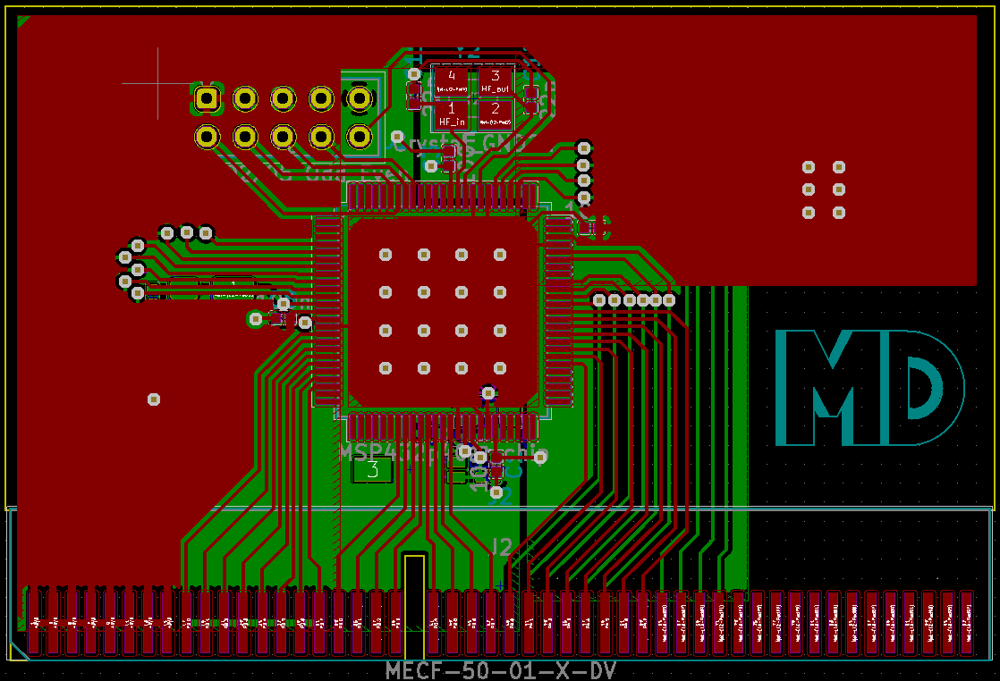

# MSP432p401r Card

### PCB for a vertically mounted MSP432p401r chip

Uses the Samtec MECF-50-01-L-DV polarized edge connector, or equivalent.

1.6mm board thickness.

Supports GPIO ports 1 through 6.
